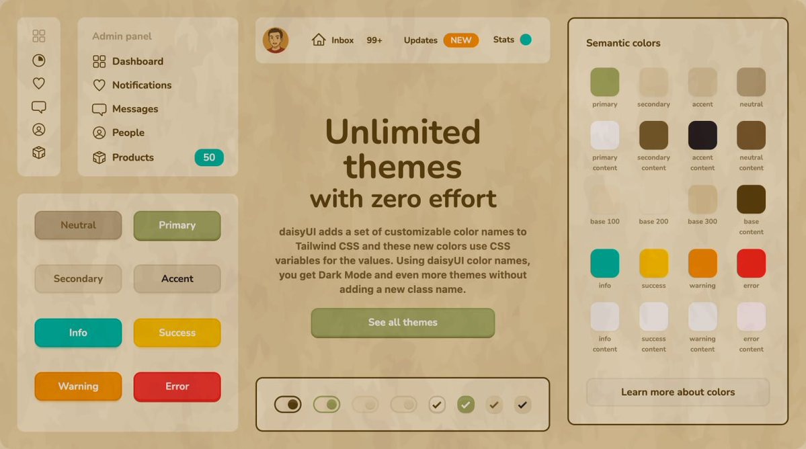

# ✨ Matsu Theme for DaisyUI

Hey there! Welcome to **Matsu** - a magical Studio Ghibli inspired theme for DaisyUI that brings the whimsical charm of Ghibli films to your web projects! 🌿



## 🌟 What's This All About?

Matsu captures the enchanting spirit of Studio Ghibli's art style with:

- Soft watercolor textures that feel like hand-painted scenes
- Warm, earthy tones inspired by "My Neighbor Totoro," "Spirited Away," and "Howl's Moving Castle"
- Whimsical UI components that add a touch of magic to your projects
- A clean, modern design that's both functional and beautiful

## 🔧 CLI Tool

**Add Matsu to your project in seconds:**

```bash
npx daisyui-matsu-theme
```

That's it! The CLI automatically detects and configures your DaisyUI v5+ and TailwindCSS v4+ project.

[More CLI options →](./cli/README.md)

## 🙋‍♂️ How Can You Help?

### Feedback & Contributions

- **Found a bug?** [Open an issue](https://github.com/HMarzban/daisyui-matsu-theme/issues)
- **Have an idea?** Share it on [Twitter/X](https://x.com/mhossein_) or through issues
- **Want to contribute?** Fork, code, and submit a pull request
- **Like the project?** Star it and share with friends

Your support helps make this project better for everyone!

## 📄 License

Released under the MIT License - so you're free to create your own magic with it!
